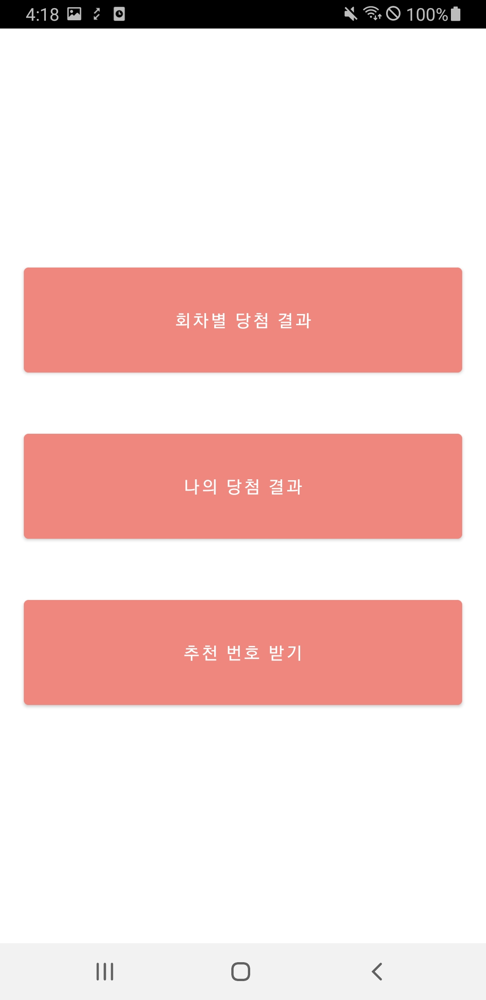

# 플리즈 로또

## 개요
동행복권 API와 웹 크롤링을 활용한 토이 프로젝트

* 활용 언어
    * Kotlin
* 활용 라이브러리
    * Android Jsoup (웹 크롤링)
    * Databinding + LiveData + RxJava
    * Retrofit2
    * BottomNavigation *(제거함)*
* API : https://www.dhlottery.co.kr/
* 앱 기본 정보
    * minSdk 26
    * targetSdk 32

> Oven Url : https://ovenapp.io/project/oCwTgHFSzOBk5cEM3SulFQuFv6lvHHml#Xl7Ge

 

___

 

## 화면

### 로고

 

### 홈화면

* 당첨번호 확인, 나의 당첨금 조회, 추천번호 확인 화면으로 넘어갈 수 있다.

 

### 당첨번호 확인

* 회차별 당첨번호와 금액을 알 수 있다.

 

### 나의 당첨금 조회

* 내가 구입한 로또 번호를 입력하면 일치하는 숫자를 체크해주고, 당첨금 합계를 계산해준다.

 

### 추천번호

* 1부터 45까지의 랜덤값을 추천번호로 뿌려준다.